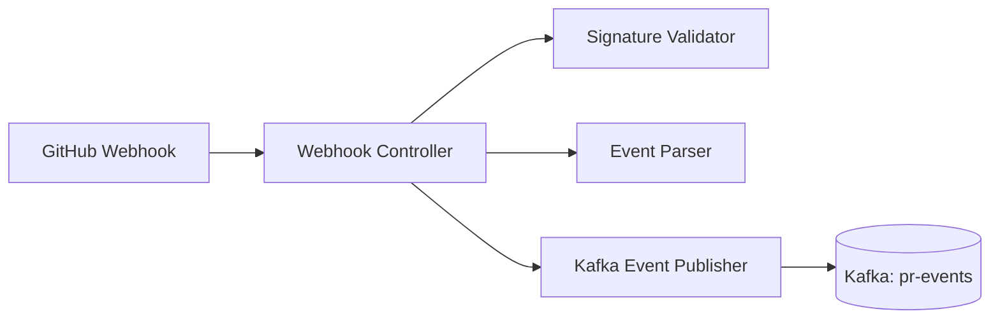

# **Webhook Service — GitHub Integration**

This service receives GitHub webhook events, validates them, parses PR metadata, and publishes normalized events to Kafka for downstream processing.

## Responsibilities
- Validate GitHub webhook signatures (HMAC SHA‑256)
- Parse pull request events
- Normalize PR metadata
- Publish events to Kafka (`pr-events` topic)
- Respond quickly (<2 seconds) to GitHub

## Architecture

## Endpoints
- `POST /webhook`: Main endpoint to receive GitHub pull requests.

## Headers
- `X-Hub-Signature-256`
- `X-GitHub-Event`
- `X-GitHub-Delivery`

## Configuration

| Name                    | Description                                  | Example Value         |
|-------------------------|----------------------------------------------|----------------------|
| GITHUB_APP_ID           | GitHub App ID                                | 123456               |
| GITHUB_PRIVATE_KEY      | GitHub App private key (PEM)                 | -----BEGIN PRIVATE...|
| GITHUB_WEBHOOK_SECRET   | Secret for validating webhooks               | mysecret             |
| KAFKA_BOOTSTRAP_SERVERS | Kafka connection string/ Kafka broker address | localhost:9092       |
